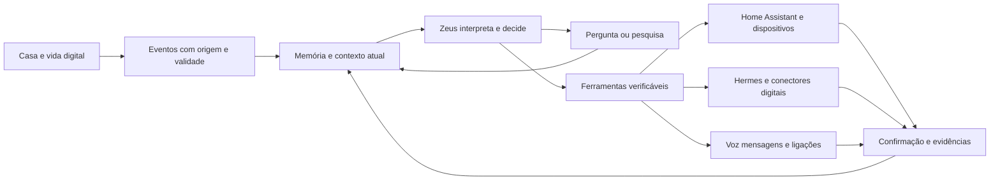

# Plano mestre de evolução do Zeus

O Zeus será uma presença pessoal persistente: percebe, reúne contexto, investiga, decide, age ou pergunta, verifica o resultado e acompanha. A persona de amigo e escudeiro, com humor e competência inspirados no Jarvis, faz parte de cada entrega. O plano não limita a ambição ao computador atual; separa a visão de produto da evidência do que funciona hoje.

## Arquitetura e alinhamento

O núcleo atual está alinhado: identidade em arquivo, memória explícita separada de hipóteses, episódios, ferramentas declaradas e canais compartilhados. A versão 0.3.0 fortalece essa base com menos contexto repetido, escuta recuperável e espera de rede/síntese fora do ciclo principal. Ainda não existe o ciclo completo de percepção do ambiente e objetivos autônomos.

Cada módulo pode evoluir sem trocar toda a arquitetura. O banco permanece fonte de estado; o modelo sugere decisões e texto. Quando faltar informação, Zeus identifica a incerteza, procura fontes ou pergunta. Nenhum prompt sozinho cria câmera, telefone, confirmação de envio ou acesso financeiro.

## Menos esforço com mais resultado

1. Reutilizar Home Assistant, ESPHome, detecção visual e motores de áudio; concentrar trabalho próprio em contexto, deliberação, continuidade e persona.
2. Medir etapas do percurso em vez de comprar hardware para compensar espera artificial. Primeiro reduzir contexto repetido, fila bloqueada e cargas repetidas; depois comparar modelos e expansão.
3. Usar detecção barata contínua e chamar raciocínio mais caro somente quando houver mudança relevante. Evitar processamento visual pesado a cada frame.
4. Manter ferramentas estruturadas e verificação do efeito; uma interface única pode acionar local ou remoto sem duplicar memória.
5. Usar a mesma suíte de jornadas para persona, modelos e releases. Testar também quando ficar quieto, quando perguntar e quando admitir falha.

## Quadro e divisão de trabalho

Quadro central: [Presença autônoma e trabalho conjunto](https://github.com/Nicolas-Assis-F/zeus/issues/1). A divisão abaixo é proposta; o executor precisa assumir a issue. Nenhum agente foi despachado automaticamente.

| Frente | Executor proposto | Tarefa |
| --- | --- | --- |
| Validar a versão 0.3.0 no X99 com voz memória e dois canais | Codex | [Abrir issue](https://github.com/Nicolas-Assis-F/zeus/issues/2) |
| Tornar mensagens e lembretes recuperáveis após falha e reinício | Codex | [Abrir issue](https://github.com/Nicolas-Assis-F/zeus/issues/3) |
| Aprofundar a persona de amigo e escudeiro com continuidade e humor | Claude | [Abrir issue](https://github.com/Nicolas-Assis-F/zeus/issues/4) |
| Escolher modelos e roteamento por qualidade latência e custo medidos | Claude | [Abrir issue](https://github.com/Nicolas-Assis-F/zeus/issues/5) |
| Entregar conversa por voz contínua com interrupção natural e baixa latência | Codex | [Abrir issue](https://github.com/Nicolas-Assis-F/zeus/issues/6) |
| Conectar a primeira percepção real com eventos rastreáveis e deduplicados | Codex | [Abrir issue](https://github.com/Nicolas-Assis-F/zeus/issues/7) |
| Criar iniciativa contextual que aprende quando agir perguntar ou ficar quieto | Claude | [Abrir issue](https://github.com/Nicolas-Assis-F/zeus/issues/8) |
| Dar ao Zeus pesquisa com fontes procedência e tratamento de incerteza | Claude | [Abrir issue](https://github.com/Nicolas-Assis-F/zeus/issues/9) |
| Expandir memória pessoal com origem correção esquecimento e recuperação seletiva | Claude | [Abrir issue](https://github.com/Nicolas-Assis-F/zeus/issues/10) |
| Integrar Home Assistant e executar ações verificáveis no ambiente | Codex | [Abrir issue](https://github.com/Nicolas-Assis-F/zeus/issues/11) |
| Dar olhos ao Zeus com percepção visual contextual e memória de evidências | Codex | [Abrir issue](https://github.com/Nicolas-Assis-F/zeus/issues/12) |
| Escalonar alertas entre casa Telegram e ligação com confirmação de recebimento | Codex | [Abrir issue](https://github.com/Nicolas-Assis-F/zeus/issues/13) |
| Unir Zeus e Hermes em objetivos persistentes e execução digital acompanhada | Claude | [Abrir issue](https://github.com/Nicolas-Assis-F/zeus/issues/14) |
| Construir o domínio financeiro futuro com registros confiáveis e alertas pessoais | Claude | [Abrir issue](https://github.com/Nicolas-Assis-F/zeus/issues/15) |
| Empacotar operação do Zeus com observabilidade recuperação e release reproduzível | Codex | [Abrir issue](https://github.com/Nicolas-Assis-F/zeus/issues/16) |
| Avaliar o Zeus como presença inteligente em jornadas completas | Claude | [Abrir issue](https://github.com/Nicolas-Assis-F/zeus/issues/17) |

## Ordem de construção

Começar pela validação da versão, confiabilidade de mensagens, persona e avaliação de modelos. Pesquisa e persona podem andar em paralelo à operação. Eventos reais permitem deliberação de rotina, visão e ações de casa. Confirmação de entrega sustenta ligação e escalonamento. Memória com procedência e pesquisa sustentam objetivos digitais; finanças entram depois como domínio separado.

Os primeiros candidatos a execução conjunta são confiabilidade e operação pelo Codex, persona e pesquisa pelo Claude. As dependências nas issues definem os pontos de integração. Os arquivos compartilhados precisam de reserva: especialmente núcleo, banco, configuração e interface.

## Demonstrações de produto

- Academia: uma fala casual ativa apenas os combinados existentes; Zeus deseja bom treino, pergunta o que não sabe e retoma a informação na hora útil.
- Entrada na casa: um evento visual recente permite avisar que alguém entrou; identidade incerta é apresentada como incerta.
- Pesquisa: uma dúvida atual leva a fontes verificáveis e uma resposta em tom natural, sem esconder incerteza.
- Projeto: Zeus lembra o ponto em que parou, executa a próxima ação autorizada e apresenta evidência de conclusão.
- Falha: serviço indisponível produz diagnóstico e recuperação; não uma alegação de que está tudo funcionando.
- Contato: aviso importante chega pelo canal apropriado, e a resposta em um canal cancela a escalada em outro.

## Evidência necessária

Código testado, integração simulada e resultado real são níveis diferentes. Para cada avanço, registrar o cenário, versão, ambiente, resultado e limitações. Nos testes de modelo: qualidade, primeira resposta e latência p50/p95. Em voz: acerto com ruído e fim de fala até resposta. Em iniciativa: benefício e interrupções desnecessárias. Em ação: estado final verificado.

## Documentos de apoio

- [Estado atual e limites observados](ESTADO_2026_09_19.md)
- [Como Codex e Claude trabalham sem sobrescrever alterações](TRABALHO_CONJUNTO.md)
- [Procedimento de atualização e validação](DESENVOLVIMENTO_E_DEPLOY.md)
- [Voz e escuta](INTERFACE_E_VOZ.md)

Base: plano mestre v2 de presença inteligente aprovado na conversa e atualização de estado fornecida por Nicolas em 19 de setembro de 2026. Esta revisão traduz a direção em tarefas implementáveis e mantém finanças numa fase posterior.

Referências de implementação consultadas: [faster-whisper](https://github.com/SYSTRAN/faster-whisper), [Ollama chat](https://docs.ollama.com/api/chat) e [OpenRouter streaming](https://openrouter.ai/docs/api_reference/streaming). Elas fundamentam contratos técnicos, não comprovam desempenho no X99.
